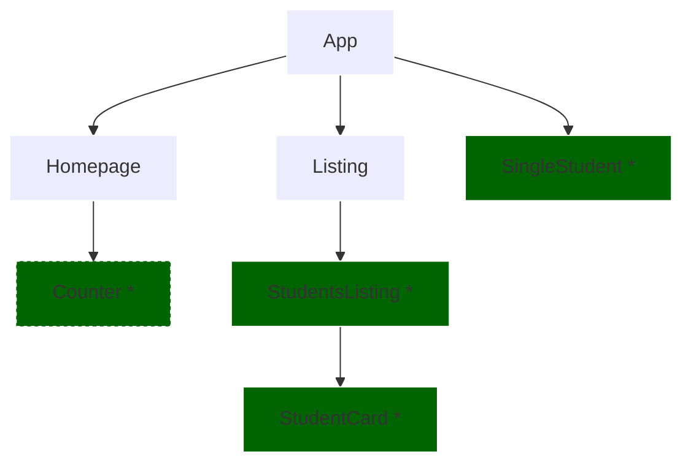

# React Exercise - Lifting State

## PROBLEM

- We want to share state between "sibling" components or with a parent component



### v1 - Starter Code

Changes since last lecture:

- Re-added the deleteItem function to StudentsList
- Re-added the handleChange and addItem functions to StudentsList

### v2 - Handle students state in App.jsx (lift state to app.jsx)

1. App.jsx:
   1. import useState
   2. create items state using the studentsData
   3. Adjust the props to match the state name
2. StudentsList.jsx:
   1. remove import of useState
   2. remove items state
   3. Adjust the props you're passing to the StudentsCard

### v3 - Relocate delete function

1. StudentsList.jsx:
   1. accept the deleteItem prop
   2. remove the deleteItem function
2. Listing.jsx:
   1. accpet the deleteItem prop
   2. pass the deleteItem prop to StudentsList.jsx
3. App.jsx
   1. add the deleteItem function
   2. pass the deleteItem function as prop to Listing.jsx

### v4 - Add the Counter Component

1. Counter.jsx

   1. Add a Counter.jsx inside de components folder
   2. Add the following to the file inside the return:

   ```
     <div className="counter">
       <span>{count}</span>
       <h3>Ironhackers</h3>
     </div>

   ```

2. Counter.css

   1. Create a Counter.css in the components folder and add the following to the file:

   ```
   .counter {
     margin: 40px 0;
   }

   .counter span {
     font-size: 72px;
     font-weight: bold;
   }

   .counter h3 {
     margin: 0;
   }

   ```

   2. Import the css file to the Counter component

3. Homepage.jsx:

   1. Add the Counter to the homepage after the h3 tag
   2. Accept the students prop

4. App.jsx:

   1. Pass students as prop to the homepage
